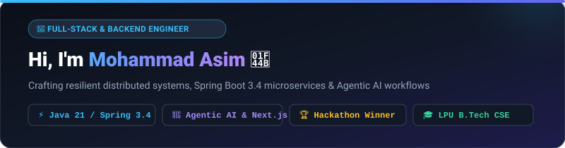

<!-- Animated Vector Hero Banner -->

 

<!-- Dynamic Typing SVG Header -->

 

<!-- Social & Profile Links Badges -->

  
  
  
  

---

### About Me

I am a **Software Engineer & Backend Specialist** pursuing a Bachelor of Technology in Computer Science & Engineering at **Lovely Professional University** (CGPA: 7.98), with an engineering foundation having graduated with a Diploma in ECE from **Jamia Millia Islamia** (Ranked 16th among 10,000+ candidates).

- **Backend Architecture & Engineering**: Specializing in **Java 21**, **Spring Boot 3.4**, **Spring Security**, and microservice architectures with high-throughput RESTful APIs, JWT/OAuth2 authentication, and WebSocket real-time communication.
- **Agentic AI & Full-Stack Systems**: Experienced in building autonomous multi-agent AI ecosystems using **Next.js**, **TypeScript**, and **Google Gemini API**.
- **Competitive Hackathons**: Winner of the **GeekVerse Hackathon** and Top 10 Finalist in **HACK AI Season 2** (24-hour national hackathon by LPU & byteXL).
- **Algorithms & Problem Solving**: In-depth experience with Data Structures, Graph Algorithms (BFS, DFS, Dijkstra's), and optimization on **LeetCode**.

 

<!-- Animated Skills Proficiency Telemetry -->

---

### Technical Skills

<table>
  <tr>
    <td width="22%" align="right"><b>Programming Languages</b></td>
    <td>
      
      
      
      
      
      
    </td>
  </tr>
  <tr>
    <td align="right"><b>Backend &amp; Microservices</b></td>
    <td>
      
      
      
      
      
      
    </td>
  </tr>
  <tr>
    <td align="right"><b>Security &amp; Databases</b></td>
    <td>
      
      
      
      
    </td>
  </tr>
  <tr>
    <td align="right"><b>Frontend &amp; AI Frameworks</b></td>
    <td>
      
      
      
      
    </td>
  </tr>
  <tr>
    <td align="right"><b>Tools &amp; DevOps</b></td>
    <td>
      
      
      
      
      
      
    </td>
  </tr>
</table>

---

### Featured Projects

<table>
  <tr>
    <td width="50%" valign="top">
      <h3><a href="https://github.com/mohammadasim07/StormAPI">StormAPI — Performance Testing Platform</a></h3>
      
<b>Full-stack HTTP API Performance, Load &amp; Stress Engineering Platform</b>

      <ul>
        <li>Architected using <b>Java 21</b> and <b>Spring Boot 3.4</b> with enterprise <b>Spring Security &amp; JWT</b>.</li>
        <li>Supports 6 rigorous testing profiles: <i>Load, Stress, Spike, Soak, Breakpoint &amp; Scalability</i>.</li>
        <li>Delivers real-time latency and throughput analytics over <b>WebSocket / STOMP</b>.</li>
        <li>Automated export engine generating comprehensive reports in <b>JSON, CSV, HTML, and PDF</b>.</li>
      </ul>
      

        
        
        
      

      <a href="https://github.com/mohammadasim07/StormAPI"><b>Explore Repository ➔</b></a>
    </td>
    <td width="50%" valign="top">
      <h3><a href="https://github.com/mohammadasim07/career-coach">CareerAI — Agentic Career Mentor</a></h3>
      
<b>Multi-Agent Autonomous AI Mentorship &amp; Placement Readiness Ecosystem</b>

      <ul>
        <li>Orchestrates <b>7 specialized AI agents</b> (Resume scoring, adaptive mock interviews, dynamic roadmaps, task planner &amp; job matching).</li>
        <li>Powered by <b>Google Gemini API</b> for intelligent prompt chains and placement readiness analysis.</li>
        <li>Built on <b>Next.js</b>, <b>TypeScript</b>, and <b>Supabase</b> with gamification, alert engine, and persistent memory.</li>
      </ul>
      

        
        
        
      

      <a href="https://github.com/mohammadasim07/career-coach"><b>Explore Repository ➔</b></a>
    </td>
  </tr>
  <tr>
    <td width="50%" valign="top">
      <h3><a href="https://github.com/mohammadasim07/student-crud-spring-boot">Student Management REST API</a></h3>
      
<b>Production-Grade CRUD Microservice with Spring Boot &amp; JPA</b>

      <ul>
        <li>Engineered clean layered architecture with DTOs, Bean Validation, and centralized Global Exception Handling.</li>
        <li>Relational persistence backed by <b>Hibernate &amp; MySQL</b> with connection pooling and query optimization.</li>
        <li>End-to-end verified with full <b>Postman</b> API test suites and documentation.</li>
      </ul>
      

        
        
        
      

      <a href="https://github.com/mohammadasim07/student-crud-spring-boot"><b>Explore Repository ➔</b></a>
    </td>
    <td width="50%" valign="top">
      <h3><a href="https://github.com/mohammadasim07/DSA">Data Structures &amp; Algorithms</a></h3>
      
<b>Algorithmic Implementations &amp; Competitive Programming Solutions</b>

      <ul>
        <li>Curated solutions for LeetCode problem sets spanning arrays, dynamic programming, trees, and graphs.</li>
        <li>Built an interactive <b>Pathfinding Visualizer</b> demonstrating <b>BFS, DFS, Dijkstra's algorithm</b>, and shortest-path heuristics.</li>
        <li>Automated syncing and continuous tracking via LeetHub integration.</li>
      </ul>
      

        
        
        
      

      <a href="https://github.com/mohammadasim07/DSA"><b>Explore Repository ➔</b></a>
    </td>
  </tr>
</table>

---

### Honors & Key Achievements

- **Winner — GeekVerse Hackathon** (May 2026): Awarded 1st place for architectural innovation, rapid prototyping, and software engineering.
- **Top 10 Finalist — HACK AI Season 2** (May 2026): Selected among the top 10 teams in a high-intensity 24-hour national hackathon hosted by Lovely Professional University in partnership with **byteXL**.
- **Adobe University Hackathon** (Aug 2026): Organized by Adobe on Unstop.
- **All-India Rank 16**: Achieved rank 16 out of 10,000+ aspirants in the competitive entrance examination for Jamia Millia Islamia.

---

### Certifications & Training

- **Programming in Java** — *NEO / iamNEO* (Jan 2026 – May 2026)
- **Data Structures and Algorithms** — *NEO / iamNEO* (Jul 2025 – Jan 2026)
- **Object-Oriented Programming** — *NEO / iamNEO* (Jul 2025 – Jan 2026)
- **Core Java Professional Training** — *CipherSchools* (Jan 2026 – May 2026)
- **DSA Placement Bootcamp: Master Data Structures & Algorithms** — *LPU* (Jun 2026 – Jul 2026)

---

### Education

- **Lovely Professional University**, Phagwara, Punjab
  - *Bachelor of Technology in Computer Science and Engineering* | **CGPA: 7.98** *(Aug 2025 – Present)*
- **Jamia Millia Islamia**, New Delhi
  - *Diploma in Electronics and Communication Engineering* | **Score: 75.1%** *(Apr 2021 – Mar 2024)*

---

### Connect & Collaborate

I am open to discussing backend engineering roles, innovative hackathon projects, and software collaborations.

  
  &nbsp;&nbsp;
  
  &nbsp;&nbsp;
  

  <i>"Passionate about turning complex computational challenges into elegant, high-throughput software solutions."</i>

